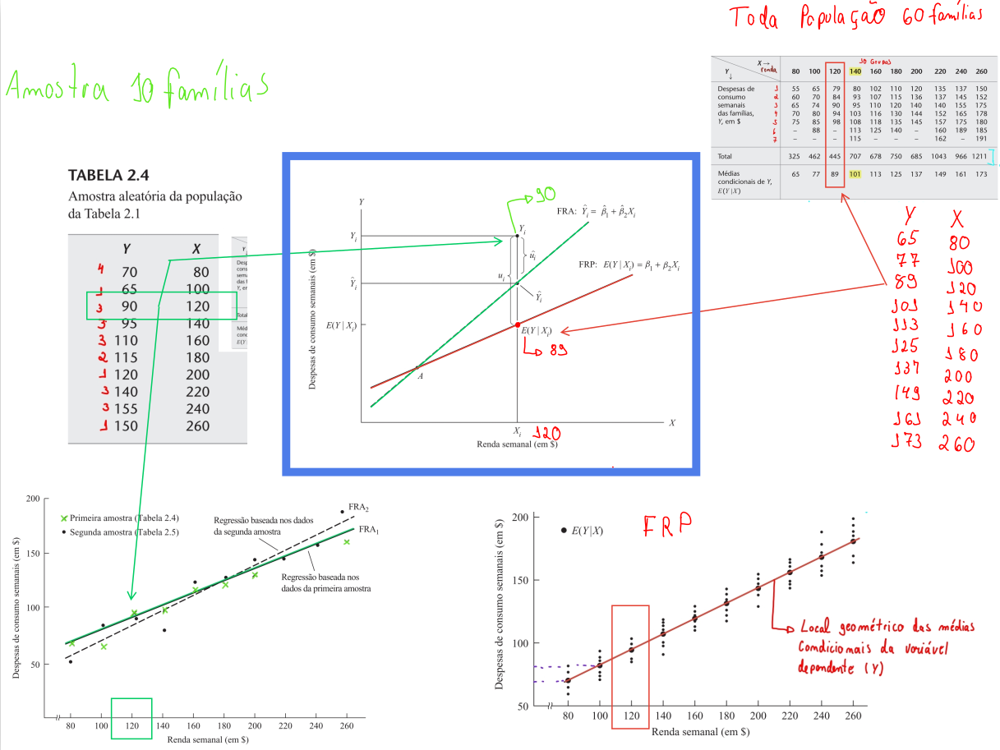

# Notas de estudo de econometria

Estas notas fazem parte dos meus estudos sobre o livro Econometria Básica 5ª edição de Damodar N. Gujarati e Dawn C. Porter. 
Ressalta-se que nessa obra há 13 capítulos dedicados ao estudo das regressões lineares dentro do contexto da ciência da econometria. 
As notas consistem em exemplos e exercícios explorados com as ferramentas do ecossistema do python.

# Sumário do livro
## Capítulo 2
Análise de regressão com duas variáveis: algumas ideias básicas 59
* 2.1 Um exemplo hipotético
* 2.2 Conceito de função de regressão populacional (FRP)
* 2.3 O significado do termo linear
* 2.4 Especificação estocástica da FRP
* 2.5 O significado do termo “erro estocástico” 
* 2.6 A função de regressão amostral (FRA)

## Capítulo 3
* 3.1 Modelo de regressão de duas variáveis: o problema da estimação
* 3.1 Método dos mínimos quadrados ordinários
* 3.2 O modelo clássico de regressão linear: as hipóteses subjacentes ao método dos mínimos quadrados
* 3.3 Precisão ou erros padrão das estimativas de mínimos quadrados
* 3.4 Propriedades dos estimadores de mínimos quadrados: o teorema de Gauss-Markov
* 3.5 O coeficiente de determinação r 2 : uma medida da “qualidade do ajustamento”

## Capítulo 4
Modelo clássico de regressão linear normal (MCRLN)
* 4.1 A distribuição de probabilidade dos termos de erro ui 
* 4.2 A hipótese de normalidade de ui 

## Capítulo 6
Extensões do modelo de regressão linear de duas variáveis 165
* 6.1 A regressão que passa pela origem
* 6.2 Escalas e unidades de medida
* 6.3 Regressão com variáveis padronizadas
* 6.4 Formas funcionais dos modelos de regressão
* 6.5 Como medir a elasticidade: o modelo log-linear
* 6.6 Modelos semilogarítmicos: log-lin e lin-log 
* 6.7 Modelos recíprocos
* 6.8 A escolha da forma funcional
* 6.9 Um comentário sobre a natureza do termo de erro estocástico:termo aditivo versus termo multiplicativo

## Capítulo 7
Análise de regressão múltipla: o problema da estimação 205
* 7.1 O modelo de três variáveis: notação e hipóteses
* 7.2 Interpretação da equação de regressão múltipla
* 7.3 O significado dos coeficientes parciais de regressão
* 7.4 estimação dos coeficientes parciais de regressão por meio dos métodos de mínimos quadrados ordinários e de e máxima verossimilhança
* 7.5 coeficiente de determinação múltiplo, R 2 , e o coeficiente de correlação múltiplo, R
* 7.7 regressão simples no contexto da regressão múltipla: uma introdução ao viés de especificação
* 7.8 R2 e R 2 ajustado
* 7.9 A função de produção Cobb-Douglas: mais sobre formas funcionais
* 7.10 Modelos de regressão polinomial
* 7.11 Coeficientes de correlação parcial - Explicação de coeficientes de correlação simples e parcial

## Capítulo 8
Análise da regressão múltipla: o problema da inferência 246
* 8.1 Novamente a hipótese da normalidade
* 8.2 Teste de hipóteses na regressão múltipla: comentários gerais
* 8.3 Testes de hipótese relativos aos coeficientes individuais de regressão 
* 8.4 Teste da significância geral da regressão amostral
* 8.5 Teste da igualdade para dois coeficientes de regressão.
* 8.6 Mínimos quadrados restritos: teste de restrições de igualdade linear
* 8.7 Teste da estabilidade estrutural ou dos parâmetros nos modelos de regressão: o teste de Chow.
* 8.8 Previsão com regressão múltipla
* 8.9 A trinca dos testes de hipótese: a razão de verossimilhança (RV), o teste de Wald (W) e o multiplicador de Lagrange (ML)
* 8.10 Teste da forma funcional da regressão: escolha entre modelos de regressão lineares e log-lineares.
